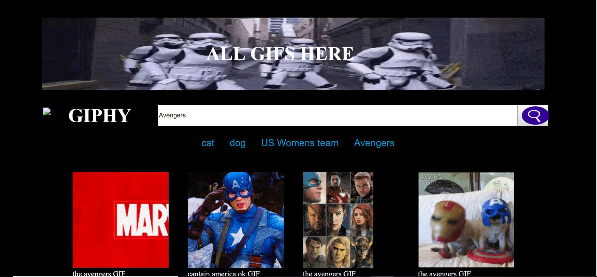

# Giphy

For this web app I used GIPHY API.

The first step is to capture the input provided by the user and turn that input into topic which is displayed as button. The input is passed into array

Whenever user inputs a value, the whole div is made empty and all buttons are named from the array created.

When user clicks the button, click event is triggered. 

The click event will triger the Giphy API and get the response of a rating, title, paused gif and animated gifs.

All the div to display the ouptput from GIPHY is dynamically generated.

Once it gets the response, initally paused GIF is displayed with rating, title and other info.  

when user clicks the paused gifs, it triggers the function which changes the src of paused gif to anmated gifs. When there is animated gifs, it changes the src to paused gifs.

The download feature, loadmore feature has been added to the application.

The user can also favorite it.

###Technologies Used
1. Giphy API
2. HTML
3. CSS
4. JavaScript
5. Bootstrap

### Deployed Version

[My Gify](https://diwal123.github.io/Giphy/)